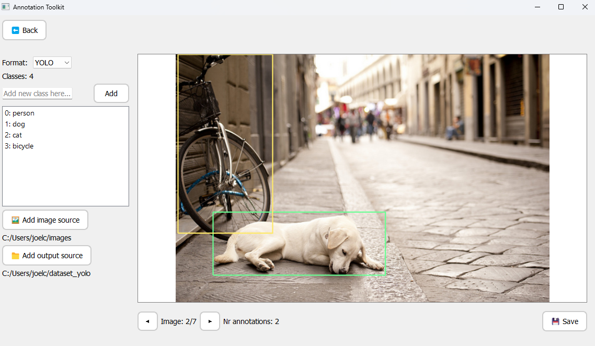
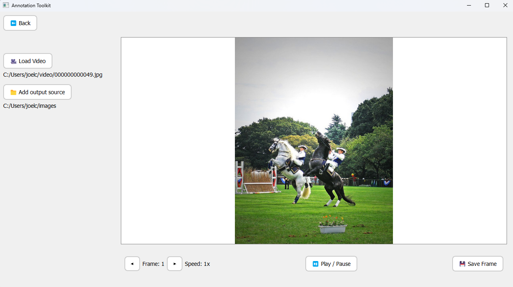

# 🎯 AnnotationToolKit

> A clean, open-source Python application for annotating object detection datasets - built entirely with PyQt5 - EASY TO USE.

---

## ✨ About

AnnotationToolKit is a lightweight, user-friendly annotation tool built entirely in Python with PyQt5. It's designed to help developers, researchers, and educators create high-quality object detection datasets — faster, easier, and fully offline.

Whether you're working with curated images or extracting frames from videos, AnnotationToolKit gives you full control over your annotation workflow — from labeling to export.

> ⚡ Most importantly! It runs entirely on your local machine, with no cloud dependencies or forced sign-ins - so your data stays private, secure, and yours.
---

## 🚀 Features

- 🎥 **Video support** – Load videos and extract frames on the fly
- 🖼️ **Image annotation** – Annotate bounding boxes across images and video frames
- 🧠 **Custom class support** – Create and manage your own class list dynamically
- 💾 **Export to popular format** – Compatible with common training pipelines
- 🧰 **Pure Python** – Easily modifiable and extendable
- 🪶 **Lightweight & cross-platform** – Runs anywhere Python runs

---

## 📦 Installation

### ✅ Requirements

- Python 3.7+
- [PyQt5](https://pypi.org/project/PyQt5/)
- [OpenCV](https://pypi.org/project/opencv-python/)

### 🔧 Setup

```bash
    git clone https://github.com/joelcic/AnnotationToolKit.git
    cd AnnotationToolKit
    python -m venv .venv
    source .venv/bin/activate   # Windows: .venv\Scripts\activate
    pip install -r requirements.txt
    python main.py
```

---
## 🧭 User Guide

AnnotationToolKit includes three main views: a welcome screen, an image/video annotation tool, and a video-to-frame extraction module. Here's how to use each part of the app:

### 🖼️ Annotation Tool

<p align="center">
  
</p>

**What it does:**  
Draw bounding boxes on images or video frames and export them in a popular dataset format.

**How to use:**
- Select your image folder using **🖼️ Add image source**
- Choose an output folder via **📁 Add output source**
- Add your classes using the text field + **➕ Add**
- Draw boxes by clicking and dragging
- Choose class via dropdown popup
- Click **💾 Save** to export
- Navigate with **◀ / ▶**


### 🎥 Video Tool

<p align="center">
  
</p>

**What it does:**  
Extract and save specific frames from video files.

**How to use:**
- Click **🎥 Load Video** to open a file
- Step through frames with **◀ / ▶**
- Use **⏯ Play / Pause** to toggle playback
- Set an output folder with **📁 Add output source**
- Use **💾 Save Frame** to export frames.

---
## 🧩 Upcoming Features

We're actively improving AnnotationToolKit to make it more powerful and flexible for all types of computer vision workflows. Here's what's on the roadmap:

- 🗂️ **Support for more export formats**

- ✏️ **Polygon & segmentation tools**

- 🤖 **Automatic annotation (AI-assisted labeling)**

- 🎨 **Custom class colors & style preferences**

- 🧱 **Resizable & draggable bounding boxes**

- 💼 **Project saving/loading**

Got an idea or need a feature? [Open an issue](https://github.com/joelcic/AnnotationToolKit/issues) — we’d love your input!

---
## 👤 Author

Made with ❤️ by **Joel Carlsson** 
